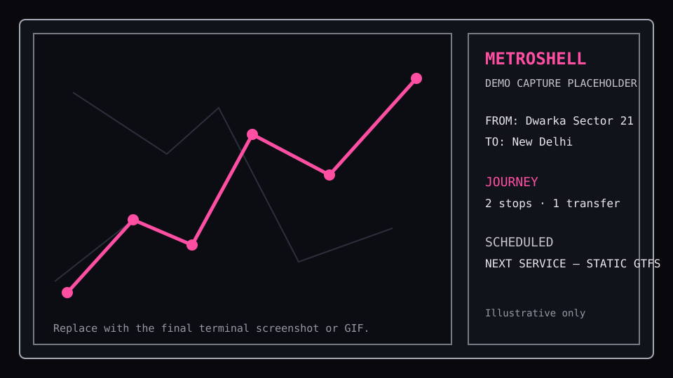

# Metroshell

Metroshell is a Delhi Metro map and route-planning demo for the terminal. It
combines a local Delhi NCR MBTiles map, an optional static GTFS snapshot, a
keyboard-first FROM/TO picker, and deterministic train motion drawn along GTFS
shapes. The local terminal program and the SSH demo server use the same
Bubble Tea application model.



> **Demo-capture placeholder:** the image above is a repository-local graphic,
> not a capture of real MBTiles or live service. Replace
> `docs/demo-capture-placeholder.svg` with the final terminal screenshot or
> animated GIF when the demo capture is ready, and keep this label/alt text
> honest if the asset is still illustrative.

## What it shows

- A quiet, braille-rendered Delhi NCR map with line-colored metro geometry and
  stations.
- Fewest-stop FROM/TO routing with transfers and line-family details.
- A centered launch splash with the exact visible credit `built by Akash
  Parashar`.
- Neutral map/sidebar shells with pink MetroShell identity accents, a sidebar
  clock showing seconds, and centered `JOURNEY` / `SCHEDULED` headings.
- Schedule-shaped, deterministic train motion. The default internal demo pace
  is 15x the feed's route timing; it is visual simulation, not train telemetry.

## Prerequisites and local data

- Go `1.26.2` (the version pinned by [go.mod](go.mod)).
- A local Delhi NCR `.mbtiles` file. The application requires this first
  argument; it does not download map data.
- Optionally, a local static GTFS directory or ZIP as the second argument. The
  feed must provide `stops.txt`, `routes.txt`, `trips.txt`, `stop_times.txt`,
  and `shapes.txt` at its root.

Keep personal map and feed data under `mapdata/`. The repository intentionally
tracks neither MBTiles nor GTFS archives; `mapdata/` contains only
`mapdata/.gitkeep` in source control.

## Run locally

Map-only mode:

```sh
go run . mapdata/delhi-ncr.mbtiles
```

Map plus a local static GTFS snapshot (directory or ZIP):

```sh
go run . mapdata/delhi-ncr.mbtiles mapdata/delhi-metro/
go run . mapdata/delhi-ncr.mbtiles mapdata/delhi-metro.zip
```

The feed loads asynchronously. A missing or invalid feed leaves the base map
usable and reports `GTFS: missing` or `GTFS: error` rather than inventing a
partial dataset.

## Run over SSH

The SSH server uses the same application model and controls as the local
program. It needs a user-owned host key and the same locally mounted MBTiles
and optional GTFS paths:

```sh
CGO_ENABLED=0 go run ./cmd/sshserver \
  --addr :2222 \
  --host-key /path/to/ssh_host_ed25519_key \
  --tiles mapdata/delhi-ncr.mbtiles \
  --gtfs mapdata/delhi-metro.zip
ssh -p 2222 <user>@<host>
```

Verify the SSH host-key fingerprint out of band before connecting. Never put
host keys, credentials, MBTiles, or feed archives in the repository.

## Keyboard and mouse controls

Station endpoint selection is keyboard-only. Mouse clicks, releases, and
motion do not select stations or move a cursor; the mouse wheel remains
available for map zoom.

| Control | Action |
| --- | --- |
| `Tab` / `Shift-Tab` | Cycle map, FROM, and TO focus |
| `Enter` | Open the focused endpoint picker; in a ready route, expand/collapse the focused journey leg |
| `↑` / `↓` or `Ctrl-J` / `Ctrl-K` in the picker | Move through station results |
| Type text in the picker | Filter stations; `Backspace` edits the search |
| `Enter` in the picker | Choose the highlighted station |
| `Esc` / `Backspace` | Cancel the picker, collapse a leg, or clear the focused endpoint |
| `w` `a` `s` `d` | Pan the map |
| `←` `→` `h` `l` | Pan the map; with a ready route and map focus, `↑` / `↓` / `j` / `k` select a journey leg |
| `+` / `=` and `-` / `_` | Zoom the map |
| Mouse wheel | Zoom the map only |
| `?` | Open the bounded keybindings help overlay |
| `q` / `Ctrl-C` | Quit |

## Static schedule and simulation boundaries

`SCHEDULED` and `NEXT SERVICE` are calculated from the supplied static GTFS
stop times and calendar rules in Delhi local time. They are not live departure
boards, realtime DMRC data, service alerts, or a network lookup. If a feed's
calendar has expired, the default demo policy may carry its weekly pattern
forward and marks that result as estimated; it still does not become realtime.

Train motion follows prepared GTFS route shapes and schedule-derived durations,
with a deterministic seed and bounded fleet. It pauses when the session is
unfocused, an overlay is open, or the terminal is too small. Routing remains a
deterministic BFS for fewest stop-to-stop hops; it does not optimize travel
time, fares, accessibility, or crowding.

Metroshell is Delhi-only and offline at runtime. It does not provide live DMRC
vehicle positions, realtime service status, automatic data downloads, or a
guarantee that a local feed is current. Local and SSH sessions share product
behavior, but SSH still needs separately configured host-key and data paths.

## Checks and release builds

Run the same checks used by pull requests:

```sh
gofmt -w $(find . -name '*.go' -type f -not -path './vendor/*')
go test ./...
go vet ./...
go build ./...
git diff --check
```

Build both entry points without CGO when preparing a release:

```sh
CGO_ENABLED=0 go build -o metroshell ./
CGO_ENABLED=0 go build -o metroshell-sshserver ./cmd/sshserver
```

The release workflow runs GoReleaser for pushed `v*` tags. It builds the local
binary for supported desktop targets and the Linux SSH binary, then publishes
archives and checksums as release assets rather than committing them. See
[docs/TESTING_AND_CI.md](docs/TESTING_AND_CI.md) for SSH smoke checks and
deployment-sensitive paths.

## Documentation

- [Product brief](docs/PRODUCT_BRIEF.md)
- [Architecture](docs/ARCHITECTURE.md)
- [Feature specifications](docs/FEATURE_SPECS.md)
- [Data and static-feed notes](docs/DATA.md)
- [Testing, CI, and release checks](docs/TESTING_AND_CI.md)
- [Roadmap and product boundaries](docs/ROADMAP.md)
- [Contribution workflow](docs/AGENT_ORCHESTRATION.md)
